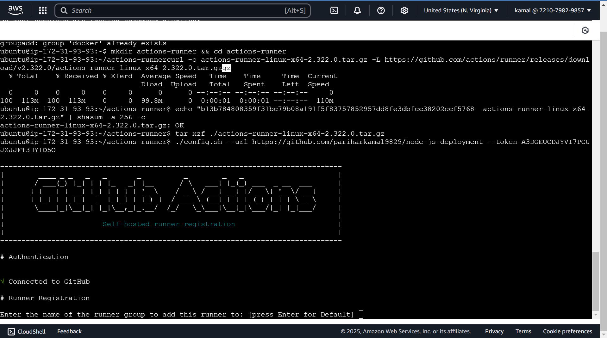
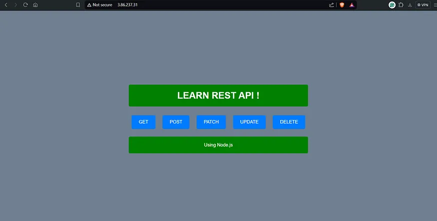

# Node.js REST API Deployment with Docker & GitHub Actions


kamlesh parihar asishsh
This project demonstrates how to build, containerize, and deploy a simple Node.js REST API using Docker and GitHub Actions for CI/CD.

## **Project Overview**

This project includes:

- A simple Node.js REST API.
- A `Dockerfile` to containerize the application.
- A `docker-compose.yml` file (optional for local setup).
- A GitHub Actions workflow for automated build and deployment.

---

## **Steps to Set Up & Deploy the Project**

### **Step 1: Create the Node.js Application**

1. Initialize a new Node.js project:
   ```sh
   mkdir node-js-deployment && cd node-js-deployment
   npm init -y
   ```
2. Install dependencies:
   ```sh
   npm install express
   ```
3. Create `index.js` with the following content:
   ```js
   const express = require("express");
   const app = express();

   app.get("/", (req, res) => {
       res.send("Hello, World! This is my Node.js REST API.");
   });

   const PORT = process.env.PORT || 80;
   app.listen(PORT, () => {
       console.log(`Server is running on port ${PORT}`);
   });
   ```

---

### **Step 2: Create a Dockerfile**

Create a `Dockerfile` in the project root:

```Dockerfile
# Use Node.js base image
FROM node:20-alpine

# Set working directory
WORKDIR /app

# Copy package.json and install dependencies
COPY package*.json ./
RUN npm install

# Copy application files
COPY . .

# Expose port and run the application
EXPOSE 80
CMD ["node", "index.js"]
```

---

### **Step 3: Build & Run Locally with Docker**

1. Build the Docker image:
   ```sh
   docker build -t kamal9829/rest-api:latest .
   ```
2. Run the container:
   ```sh
   docker run -d -p 80:80 --name rest-api-container kamal9829/rest-api
   ```
3. Test the API:
   ```sh
   curl http://localhost
   ```

---

### **Step 4: Push Docker Image to DockerHub**

1. Log in to DockerHub:
   ```sh
   docker login -u YOUR_DOCKERHUB_USERNAME -p YOUR_DOCKERHUB_PASSWORD
   ```
2. Push the image:
   ```sh
   docker push kamal9829/rest-api:latest
   ```

---

### **Step 5: Setup GitHub Actions for CI/CD**

Create `.github/workflows/docker.yml` with the following content:

```yaml
name: CI/CD for Node.js REST API

on:
  push:
    branches: [main]
  workflow_dispatch:

permissions:
  contents: write

jobs:
  Build:
    runs-on: ubuntu-latest
    steps:
      - name: Checkout repository
        uses: actions/checkout@v3

      - name: Login to DockerHub
        env:
          DOCKER_USERNAME: ${{ secrets.DOCKER_USERNAME }}
          DOCKER_PASSWORD: ${{ secrets.DOCKER_PASSWORD }}
        run: echo $DOCKER_PASSWORD | docker login -u $DOCKER_USERNAME --password-stdin

      - name: Build Docker Image
        run: docker build -t kamal9829/rest-api:latest .

      - name: Push to DockerHub
        run: docker push kamal9829/rest-api:latest

  Deploy:
    runs-on: self-hosted
    steps:
      - name: Pull the Docker Image
        run: docker pull kamal9829/rest-api:latest

      - name: Delete Old Container
        run: |
          if [ "$(docker ps -q -f name=rest-api-container)" ]; then
            docker stop rest-api-container
            docker rm rest-api-container
          fi

      - name: Run the Container
        run: docker run -d -p 80:80 --name rest-api-container kamal9829/rest-api
```

---

### **Step 6: Add Secrets in GitHub Repository**

- Go to **Settings** → **Secrets and variables** → **Actions**.
- Add the following secrets:
  - `DOCKER_USERNAME`: Your DockerHub username.
  - `DOCKER_PASSWORD`: Your DockerHub password.

---

### **Step 7: Commit & Push the Code**

```sh
git init
git add .
git commit -m "Initial commit"
git branch -M main
git remote add origin YOUR_GITHUB_REPO_URL
git push -u origin main
```

---

### **Step 8: Deploy & Test the Application**

- The GitHub Actions workflow will automatically build and deploy the application.
- After deployment, test it using your public IP:
  ```sh
  curl http://YOUR_PUBLIC_IP
  ```

---

## **Conclusion**

With these steps, you successfully: ✅ Built a Node.js REST API 🚀\
✅ Containerized it using Docker 🐳\
✅ Pushed the image to DockerHub 📦\
✅ Automated deployment using GitHub Actions ⚙️\
✅ Deployed it to a self-hosted runner on an Ubuntu server 💻

Your project is now live! 🎉 Let me know if you need any improvements!

